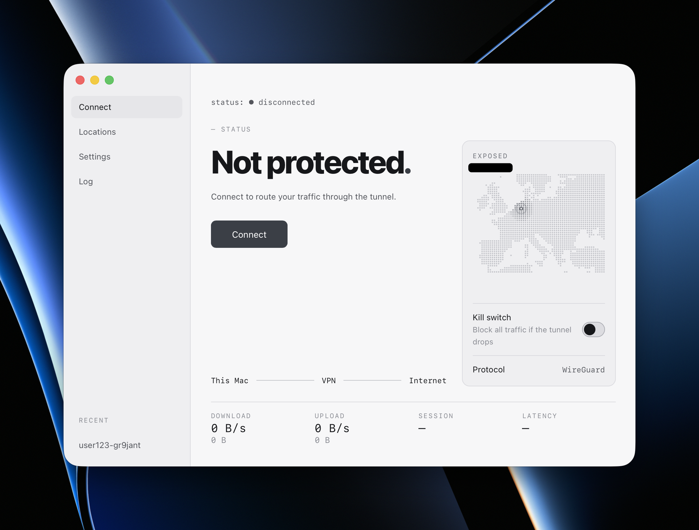

# max-vpn

VPN client for macOS. Supports WireGuard, VLESS, and OpenVPN.

## Requirements

- macOS 14+ (Apple Silicon)
- [Go](https://go.dev/dl/)
- [Node.js](https://nodejs.org/) 20+
- OpenVPN (`brew install openvpn`, required for OpenVPN profiles)

## Install

```sh
make pkg && sudo installer -pkg build/max-vpn.pkg -target /
open /Applications/max-vpn.app
```

## Use

1. Open **Locations**.
2. Add a server:
   - **WireGuard**: click **Import file** and pick your `.conf`.
   - **OpenVPN**: click **Import file** and pick your `.ovpn`.
   - **VLESS**: paste your `vless://…` link and click **Add**.
3. Go to **Connect** and click **Connect**.

## Uninstall

```sh
make uninstall-daemon && sudo rm -rf /Applications/max-vpn.app
```

## No internet after a crash?

```sh
sudo pfctl -a com.apple/maxvpn -F all
sudo networksetup -setdnsservers Wi-Fi Empty
```




## License

MIT
